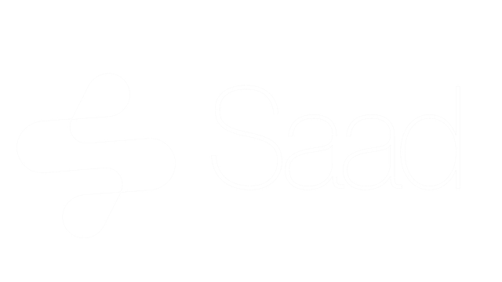

<div align="center">



<br />

# A small studio. An entire world.

**The personal portfolio of Syed Saad Ahmed.**  
Designer. Developer. Hollow Knight enthusiast.

A place to explore the work, meet the maker,  
and find out what we could build together.

<br />

[Enter the archive](#the-work) · [Meet the maker](#behind-the-portrait) · [Run locally](#enter-this-world)

---

</div>

## Every good world hides a little magic.

I wanted a portfolio that felt like somewhere you could go.

Not just a collection of screenshots, but a place with atmosphere:
quiet corners, strange little characters, a portrait that opens a portal,
and another environment waiting further down.

Hollow Knight gave me the inspiration. My own work gave me the reason
to build it.

Scroll through the world, or choose a chapter and step inside.

<br />

## A map for the curious

| Chapter | What lives here |
|:---|:---|
| **The surface** | An introduction, a sleeping Knight, and a few paths forward. |
| **The maker** | My story, experience, and the person behind the studio. |
| **The archive** | Websites, platforms, and personal experiments brought to life. |
| **The arsenal** | The tools and skills I use to build them. |
| **The workshop** | Design, development, and creative direction. |
| **The quiet clearing** | A place to start a conversation. |

The homepage descends through six environments. Dedicated About,
Projects, Services, and Contact pages let each chapter breathe.

<br />

## The work

### iLovePhysio
**A personal project about seeing anatomy and understanding movement.**

Interactive anatomy models, illustrated atlases, and guided learning,
connected through a searchable resource library.

Built with **Astro, TypeScript, React, PostgreSQL, Better Auth,
and model-viewer**.

[Explore iLovePhysio →](https://ilovephysio.saadstudio.space/)

---

### Cohorts App
A place for creators to bring communities, courses, and members together.

### InkWorldWide
WordPress and frontend work across responsive business websites.

### Shifa Foundation
A digital home for an NGO, with a donation flow supporting its work.

### Medicalshala
Healthcare workflows, real-time communication, and connected services.

### SwiftCare
Appointment booking and tools for managing doctors’ schedules.

### MERN Job Portal
Job listings, search, profiles, and account access.

Each project shares the same gallery format: a website preview,
an introduction, the technology behind it, and expandable build notes.

<br />

## Behind the portrait

I’m **Saad**, a designer and developer based in **Mysore, India**.

I run my own creative studio, which means I get to care about both
sides of a website: how it feels and how it works.

Alongside the studio, I work as a **Project Coordinator & Software
Developer at Xentric Integrated Solutions Pvt. Ltd**, Bangalore.

My work there connects telecom deployment data, technical teams,
field operations, and hands-on platform development.

I like projects where visual thinking and practical problem-solving
get to sit at the same table.

<br />

## Small details, deliberately built

- **An arrival sequence** prepares the opening assets before revealing the world.
- **A portrait portal** connects Home and About.
- **Different atmospheres** give the levels their own character.
- **Soft black fades** let environments blend into one another.
- **A resting chamber** gives the footer a place in the world.
- **Expandable project notes** keep the gallery readable without hiding the thinking.

The atmosphere matters. So does being able to use the website.

Motion respects reduced-motion preferences. Decorative effects pause
when they leave the screen. Images use optimised assets, and secondary
pages load on demand.

<br />

## Under the scenery

| Layer | Tools |
|:---|:---|
| Interface | React 19 · TypeScript |
| Styling | Tailwind CSS 4 · Custom CSS |
| Motion | GSAP · ScrollTrigger · CSS |
| Navigation | React Router |
| Development | Vite 7 · ESLint |
| Contact | Web3Forms |

> Astro powers **iLovePhysio**, the featured personal project.
> This portfolio itself is built with **React and Vite**.

<br />

## Enter this world

```bash
git clone https://github.com/CosZmo77/NewPortFolio.git
cd NewPortFolio
npm install
npm run dev
```

Open the local address printed by Vite.

### Check the build

```bash
npm run lint
npm run build
npm run preview
```

The contact form uses Web3Forms and requires an internet connection
to deliver messages.

<br />

## Find your way through the code

```text
src/
├── components/    The reusable pieces of the world
├── data/          Shared project content
├── hooks/         Arrival, visibility, and descent behaviour
├── lib/           Navigation helpers
├── pages/         Home and the dedicated chapters
└── styles/        The visual language of each environment

public/assets/
├── Images/        Original artwork
├── optimized/     Lightweight assets used by the portfolio
└── physio/        iLovePhysio imagery and attribution

scripts/           Asset preparation utilities
```

Project content lives in `src/data/projects.ts`.
The homepage and full archive use the same gallery component,
so updates stay consistent.

<br />

## A note on the inspiration

This is an independent personal portfolio inspired by **Hollow Knight**.

Hollow Knight and its associated characters and artwork belong to
**Team Cherry** and their respective owners. This project is not
affiliated with or endorsed by Team Cherry.

Anatomy asset attribution is recorded in
[`public/assets/physio/ATTRIBUTION.md`](public/assets/physio/ATTRIBUTION.md).

---

<div align="center">

### What shall we make next?

A half-formed idea is a perfectly good place to start.

[Email](mailto:syedsaadahmed77@gmail.com) ·
[LinkedIn](https://www.linkedin.com/in/saad25492/) ·
[GitHub](https://github.com/CosZmo77)

<br />

**Imagined and built in Mysore, India.**

*You found a quiet corner. Stay a while.*

</div>
